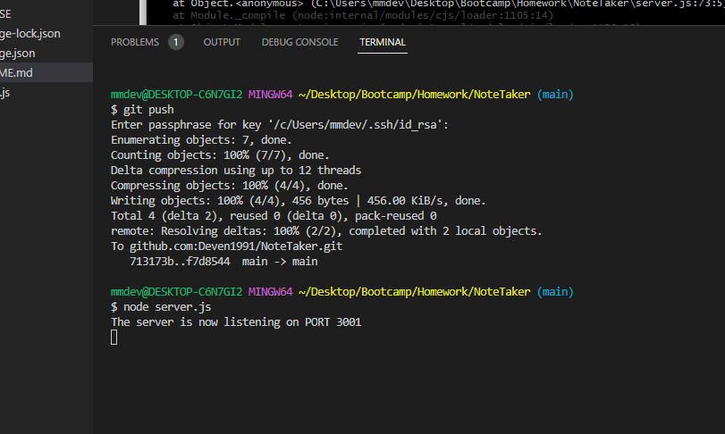

# NoteTaker

## Description

This application can be used to write and save notes. The application uses an Express.js back-end and will save and retrieve notes from a JSON file. 

## Table of Contents 

- [Installation](#installation)
- [Usage](#usage)
- [License](#license)
- [Links](#links)

## Installation

In order to install dependencies, run the command "npm i" in the command line. 

## Usage

Once the user is in the folder of the project files, run "node server.js" in the command line. 

Open the website linked in the below section, and click "Get Started" as shown below.

## License

The last section of a high-quality README file is the license. This lets other developers know what they can and cannot do with your project. If you need help choosing a license, refer to [https://choosealicense.com/](https://choosealicense.com/).

---

This application uses an ISC license - linked here: https://choosealicense.com/licenses/isc/

## Links

The application was deployed to Heroku and can be found at this link: https://notetaker411.herokuapp.com/

GitHub Repo Link: https://github.com/Deven1991/NoteTaker.git